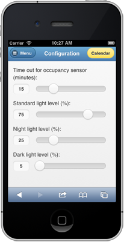
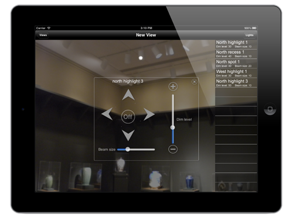

##DIDCL
By Jun Xiao

####Last updated on 11/21/2013

## Introduction

DIDCL is a prototype software for LED light duct control written with [node.js](http://nodejs.org) and [jQuery Mobile](http://jquerymobile.com).

##Demo Network setup##
The server and the client shall join the arduino wireless network. And the server should get the IP address of 192.168.1.162 for the arduino board to connect to. 
##Server setup##
Install Node.js on the server (current Version: v0.10.12) and copy all the source files from the depository under a directory.

##Client UI##

Only a small subset of functions are exposed in this demo.

* Occupancy sensing: change the slider value. Set the value to zero will deactivate the sensor for other demo purposes. Set the value other than zero will set the timeout in seconds for the occupancy sensing (after the time out if the sensor does not detect any movement, the lights will change from 100% to 10%).
* Light control: select the light(s) and change the slider value from zero to 100 percent output.
* Fan control: select the fan(s) and change the slider value from zero to 100 percent output.
* Correlated light demo: change the slider value (overall brightness of the 2 light groups defined by MCU) to active the demo.
* Diagnose light engine: click on the button to send the query message to the MCU and within seconds the UI should be updated with readings from MCU.

